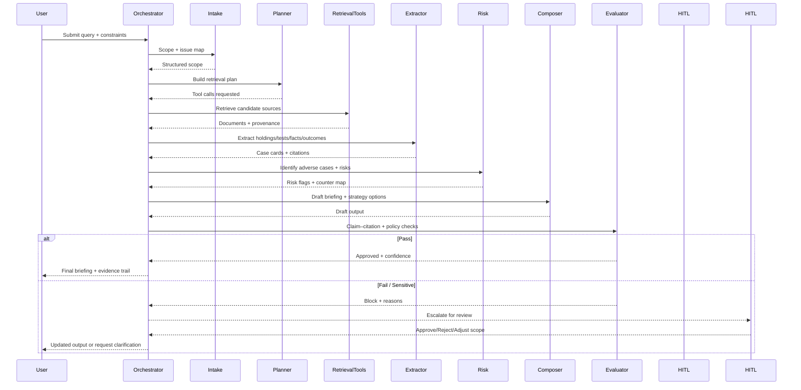
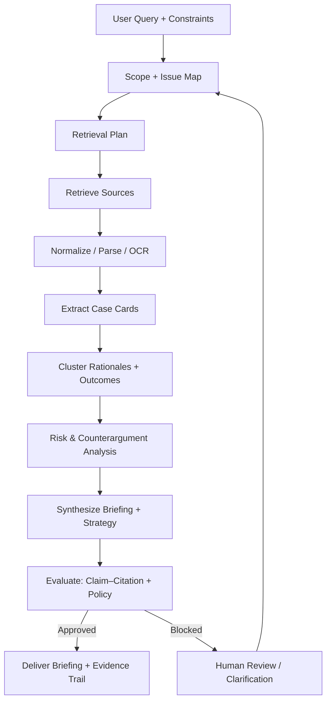
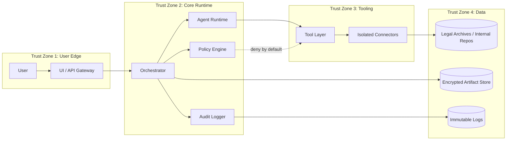

# Diagram previews

This page provides GitHub-renderable Mermaid previews. Source files remain in [`/diagrams`](../diagrams/).

## System architecture

```mermaid
flowchart LR
  U[Legal Professional / Researcher] -->|Query + Constraints| UI[UI / API Gateway]
  UI --> AUTH[AuthN/AuthZ + Session Policy]
  AUTH --> ORCH[Orchestrator / Workflow Engine]

  ORCH --> A1[Intake & Scoping Agent]
  ORCH --> A2[Retrieval Planner Agent]
  ORCH --> A3[Case Extractor Agent]
  ORCH --> A4[Outcome Pattern Agent]
  ORCH --> A5[Risk & Counterargument Agent]
  ORCH --> A6[Briefing Composer Agent]
  ORCH --> EVAL[Evaluator / Auditor Agent]

  A2 --> TOOLS[Tool Layer]
  A3 --> TOOLS
  TOOLS --> CONN[Retrieval Connectors (Isolated)]
  CONN --> SRC[(Legal Archives / Internal Repos)]

  ORCH --> DATA[(Encrypted Data Store)]
  ORCH --> LOGS[(Immutable Audit Logs)]
  EVAL --> LOGS

  EVAL -->|Pass| UI
  EVAL -->|Block / Escalate| HITL[Human Review]
  HITL --> ORCH
  UI -->|Briefing + Evidence| U
```

## Agent orchestration



## Data flow



## Trust boundaries


